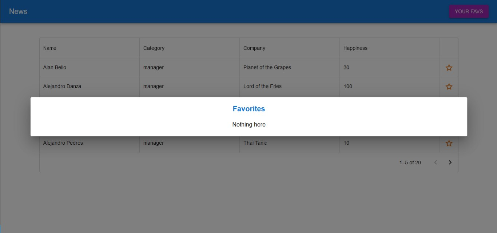

# People table :rocket:

## What is about :question:
An app made with ReactJS+MUI and Typescript based on a [Gentleman Programming](https://www.youtube.com/@GentlemanProgramming/featured) video.

This project is the resolution of a test for a senior interview and the idea of ​​it is to use clean architecture while using redux to manage states.

 If you are interested in knowing more about the requirements and fundamentals of this project you can do it [from here](https://www.youtube.com/watch?v=p9PAmqpCWgA&t=1550s).

 Support him by subscribing to his channel :smile:.

Later I will comment other details about the app.

## The assignment :memo:

Given a employees mock data file, the objective is to make a table where they can be listed and we be able to:

- Sort them by  their respective attributes
- Filter and search
- Mark employees as favorites

You must also be able to access a list that filters favorite employees and displays it within a modal that can be accessed from the navigation bar. Favorite employees should be able to be removed from the list without leaving the modal.

## Screenshot :calling:

## Try it out
For this project I used v18.13.0 of NodeJS. There is a *.nvmrc* file to select the correct version with **nvm**. If you don't have it, ensure that you have installed that specific node version.

See [nvm](https://github.com/nvm-sh/nvm) or [nvm-windows](https://github.com/coreybutler/nvm-windows) for more info.

Download the project, open a console in the corresponding directory and type:

-  `npm i` to install packages.
-  `npm run dev` to run the app.

## Diff :jigsaw:
If you check the [GP repo](https://github.com/Gentleman-Programming/GentlemanTestReact) you may realize that some differences are between codes.

I made some changes that I think are improvements to the components reuse and the 'scalability' of the App. For instance, I made a reusable table component who can receive a people array as a prop to displays in it.

Also there are some other changes, like types or conditional renders.

I invite you to check this repo so you can find what that changes are. :smile:

## Unexpected error :no_entry:
While developing the table which uses the DataGrid component from x-data-package the following unexpected error was thrown by the browser:

*"React does not recognize the `focusElementRef` prop on a DOM element."*

Aparrently this props belongs to a MUI Data Grid component called **GridFilterForm**. Unfortunalety I did not found any solution for this log.

However the application still works.

## Contact me :email:
#### [manufer6503@gmail.com](mailto:manufer6503@gmail.com)